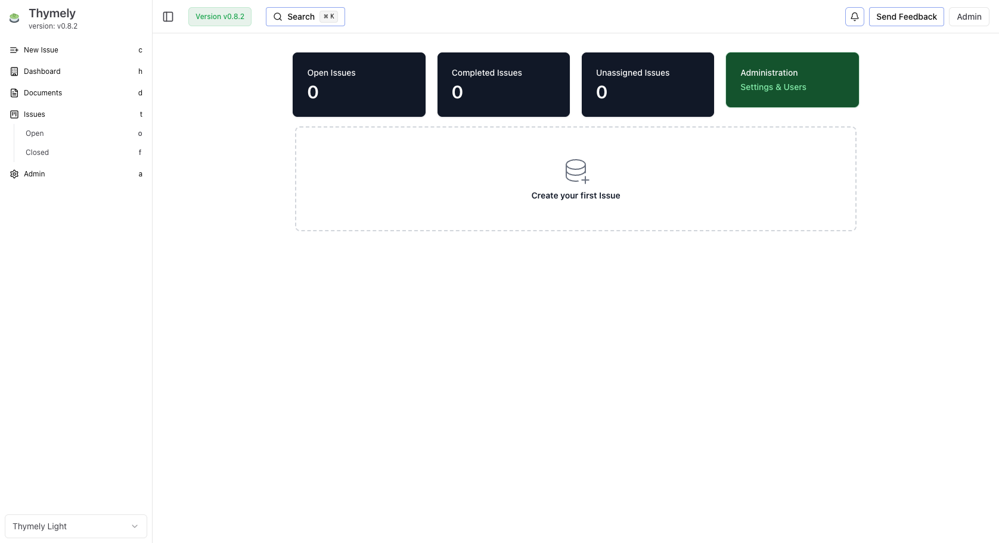
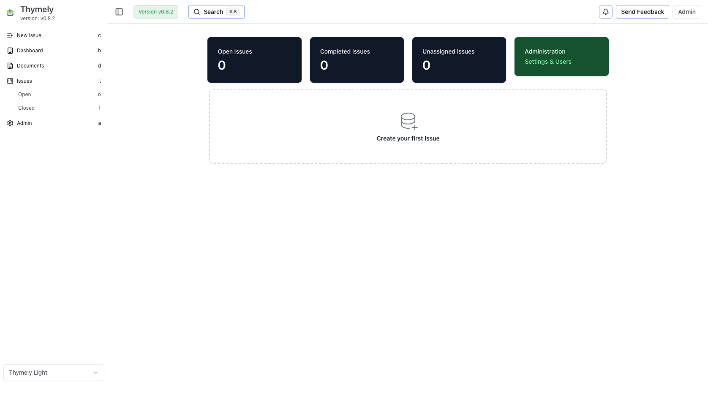
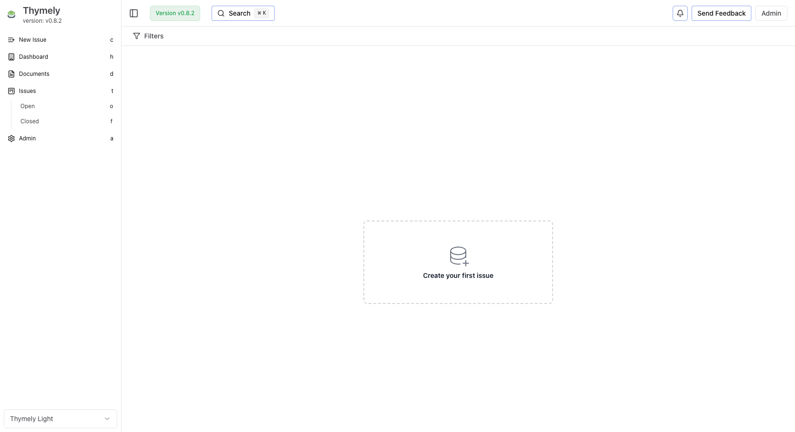
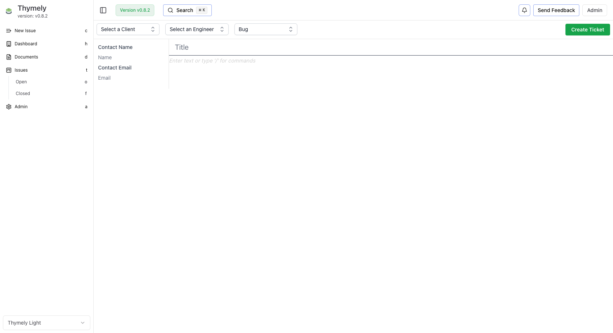
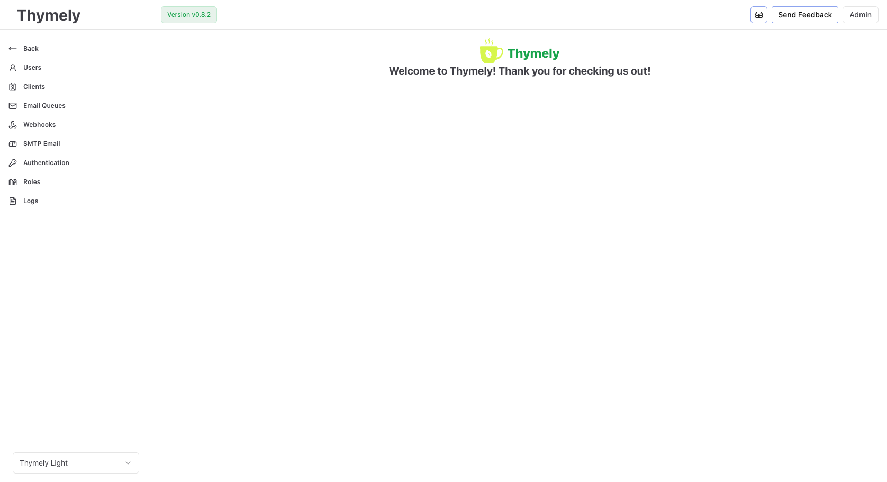

<h1 align="center">Thymely</h1>

<p align="center">
  Free, open-source, self-hosted helpdesk for small businesses and internal teams.
</p>

<p align="center">
  
  
  <a href="https://ghcr.io/gitcroque/thymely">
    
  </a>
</p>

<p align="center">
  
</p>

## Why Thymely?

Most open-source helpdesks are either abandoned, painful to self-host, or bloated with enterprise features nobody asked for. Thymely is the opposite:

- **Simple** -- one `docker compose up` to get running. No Kubernetes, no Redis, no Elasticsearch.
- **Lightweight** -- Fastify + Next.js + PostgreSQL. That's it.
- **Actually maintained** -- forked from Peppermint (abandoned at v0.5.5) and actively developed since.
- **Your data, your server** -- no cloud dependency, no telemetry by default, AGPL-3.0 licensed.

## Features

- **Ticket management** -- create, assign, track, and close tickets with a rich text editor
- **Role-based access control (RBAC)** -- granular permissions per role
- **Email integration** -- inbound (IMAP) and outbound (SMTP) email-to-ticket
- **Client portal** -- external clients can submit and follow their tickets
- **Time tracking** -- log time spent on tickets
- **File attachments** -- upload files to tickets (10 MB limit, MIME whitelist)
- **Webhooks** -- Discord, Slack, and custom HTTP webhooks
- **Audit logging** -- structured logs for security and compliance (GDPR erase endpoint included)
- **Multi-language** -- 16 languages (EN, FR, DE, ES, IT, PT, DA, NO, SE, TR, TH, HU, IS, HE, TL, ZH)
- **Authentication** -- local (email/password), OAuth2, OIDC
- **Knowledge base** -- public-facing help center for your clients
- **API documentation** -- interactive OpenAPI/Swagger at `/documentation`
- **Multi-arch Docker** -- linux/amd64 and linux/arm64

<details>
<summary>Screenshots</summary>

| Dashboard | Tickets |
|-----------|---------|
|  |  |

| New ticket | Admin |
|------------|-------|
|  |  |

</details>

## Quick start

### 1. Clone and configure

```bash
git clone https://github.com/GitCroque/thymely.git
cd thymely
cp .env.example .env
```

Edit `.env` and set at minimum:

```env
POSTGRES_USER=thymely
POSTGRES_PASSWORD=<strong-password>
POSTGRES_DB=thymely
DATABASE_URL=postgresql://thymely:<strong-password>@thymely_postgres:5432/thymely

SECRET=<openssl rand -base64 48>
DATA_ENCRYPTION_KEY=<openssl rand -hex 32>
THYMELY_BOOTSTRAP_PASSWORD=<admin-password>
```

### 2. Start

```bash
docker compose up -d
```

This starts PostgreSQL, runs migrations and seed via a one-shot init container, then starts the app. No manual database setup needed.

### 3. Log in

Open `http://localhost:3000` and log in with:

- **Email:** `admin@admin.com`
- **Password:** the value you set in `THYMELY_BOOTSTRAP_PASSWORD`

You'll be guided through a setup wizard on first login.

## Configuration

All configuration is done through environment variables. See [`.env.example`](.env.example) for the complete list with descriptions.

| Variable | Required | Description |
| --- | --- | --- |
| `DATABASE_URL` | Yes | PostgreSQL connection string |
| `SECRET` | Yes | JWT signing key (base64, min 32 chars) |
| `DATA_ENCRYPTION_KEY` | Recommended | AES key for secrets at rest (`openssl rand -hex 32`) |
| `THYMELY_BOOTSTRAP_PASSWORD` | Yes | Initial admin password (used during first setup) |
| `CORS_ORIGIN` | Production | Allowed origins, comma-separated |
| `TRUST_PROXY` | Production | `true` when behind a reverse proxy |
| `COOKIE_SECURE` | Production | `true` when serving over HTTPS |
| `SENTRY_DSN` | No | Sentry error tracking (leave empty to disable) |
| `NEXT_PUBLIC_SENTRY_DSN` | No | Sentry DSN for the frontend |
| `POSTHOG_API_KEY` | No | PostHog analytics (leave empty to disable) |
| `LOG_LEVEL` | No | Pino log level (default: `info`) |

## Deploying behind a reverse proxy

When running Thymely behind nginx, Caddy, Traefik, or similar:

1. Set `TRUST_PROXY=true` so Fastify trusts `X-Forwarded-*` headers
2. Set `COOKIE_SECURE=true` to enforce HTTPS-only session cookies
3. Set `CORS_ORIGIN=https://your-domain.com`
4. Proxy traffic to port **3000** -- the frontend rewrites `/api/v1/*` to the backend internally

Example nginx config:

```nginx
server {
    listen 443 ssl;
    server_name help.example.com;

    location / {
        proxy_pass http://localhost:3000;
        proxy_set_header Host $host;
        proxy_set_header X-Real-IP $remote_addr;
        proxy_set_header X-Forwarded-For $proxy_add_x_forwarded_for;
        proxy_set_header X-Forwarded-Proto $scheme;
    }
}
```

## API documentation

Interactive API docs (OpenAPI/Swagger) are available at `/documentation` on your instance -- e.g. `http://localhost:5003/documentation`. All endpoints are documented with JSON schemas, grouped by domain.

## Upgrading

```bash
docker compose pull
docker compose up -d
```

The init container runs pending migrations automatically. Check logs with:

```bash
docker compose logs thymely_init
```

## Development

**Requirements:** Node.js 22+, Yarn 4, PostgreSQL 17

```bash
yarn install
yarn dev          # Start all apps in dev mode (Turbo)
yarn build        # Build everything
yarn lint         # Lint (ESLint 9, flat config)
yarn test         # Unit tests (Vitest)
yarn test:e2e     # E2E tests (Playwright)
```

### Project structure

```
apps/
  api/              Fastify 5 + Prisma 5 backend (port 5003)
  client/           Next.js 16 frontend (port 3000)
  docs/             Documentation site (Nextra 4)
  knowledge-base/   Public knowledge base (port 3002)
  landing/          Landing page
packages/
  config/           Shared ESLint config
  tsconfig/         Shared TypeScript config
```

### Running E2E tests locally

E2E tests run against the full Docker stack:

```bash
docker compose -f docker-compose.local.yml up -d --build
npx playwright install chromium    # first time only
yarn test:e2e
docker compose -f docker-compose.local.yml down -v
```

## Troubleshooting

**Container won't start / init fails:**
Check `docker compose logs thymely_init`. Most common cause: `DATABASE_URL` doesn't match your PostgreSQL credentials.

**"Invalid credentials" on first login:**
The admin email is `admin@admin.com` (not your email). Password is whatever you set in `THYMELY_BOOTSTRAP_PASSWORD`.

**Cookies not working behind proxy:**
Make sure `TRUST_PROXY=true` and `COOKIE_SECURE=true` are set. The proxy must forward `X-Forwarded-Proto: https`.

**CORS errors in browser console:**
Set `CORS_ORIGIN` to your frontend URL (e.g. `https://help.example.com`).

## Contributing

Contributions are welcome. Please open an issue before submitting large changes so we can discuss the approach.

## Origin

Thymely is a fork of [Peppermint](https://github.com/Jeehut/Peppermint) (abandoned at v0.5.5). It has since been extensively rewritten: new auth system, RBAC, audit logging, client portal, email integration, setup wizard, API documentation, and more.

## License

[AGPL-3.0](LICENSE)

## Links

- **GitHub:** [github.com/GitCroque/thymely](https://github.com/GitCroque/thymely)
- **Mastodon:** [@jugue@mastodon.social](https://mastodon.social/@jugue)
